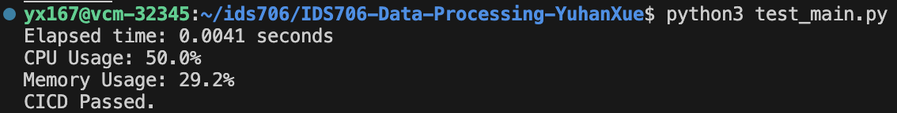
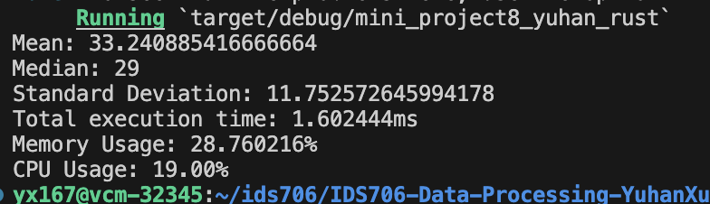

# IDS706-Data-Processing-YuhanXue


This repo contains Python/Rust scripts for the IDS706 Mini Project 4. The scripts reads a CSV dataset, calculates descriptive statistics. In the meantime, we measure the processing time/cpu/memory usage of both Python and Rust for comparison.

## Getting Started
Before running Python script, please install all dependecies:
```
pip install -r requirements.txt
```
To see the statistics from Python script, run:
```
python3 main.py
```
To see the statistics along with the performance results, run:
```
python3 test_main.py
```

Before running Rust script, please build:
```
cargo build
```
Then get statistics along with performance result:
```
cargo run
```

## Results



In general, Rust outperforms Python in execution time (0.0016s vs. 0.0041s) and CPU usage (19% vs 50%). On the other hand, memory usage (28.76% vs. 28.75%) does not make much difference, and this is probably due to the fact that the amount of data being read into the memory is roughly the same.